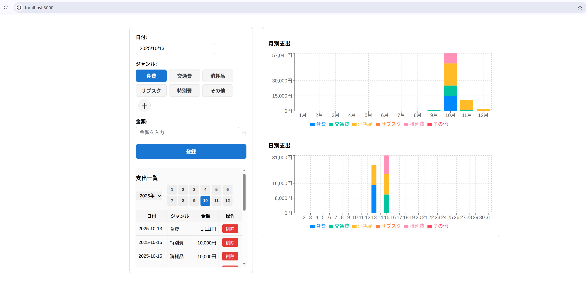
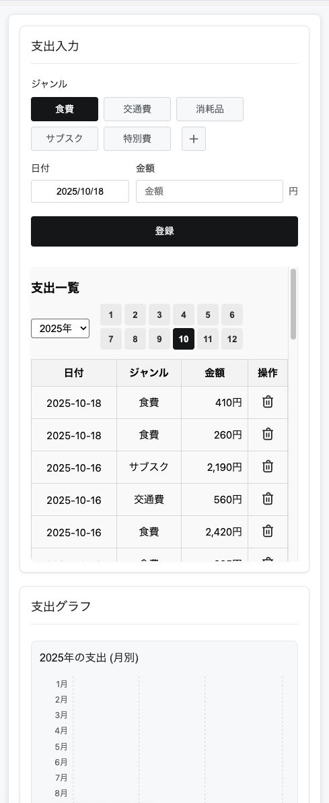
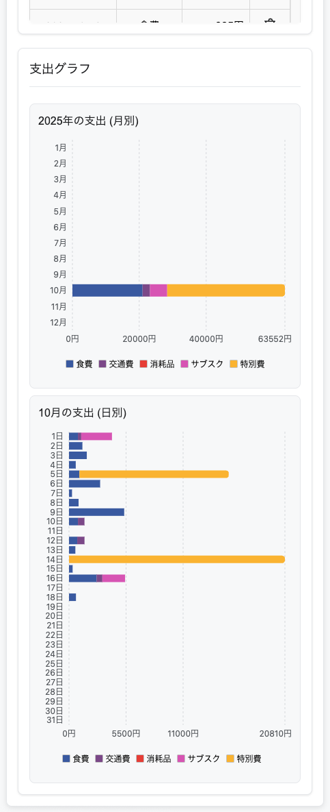

# 支出管理アプリ（shishutsukan）

このリポジトリは「支出管理アプリ」です。  
React（フロントエンド） + FastAPI（バックエンド） + SQLite（データベース）構成で、日々の支出をジャンルごとに入力・集計・分析できます。

---

## 操作画面
一覧性・操作性を重視したシンプルなUIで、PC・スマホ両対応のレスポンシブデザインを採用。

<p><b>横長表示</b></p>


<p><b>縦長表示</b></p>
<div style="display: flex; gap: 10px;">


</div>

## 主な機能

- 支出の登録（ジャンル・日付・金額）
- 登録済み支出の一覧表示・削除
- 月ごとのジャンル別集計グラフ表示
- 今月の日別ジャンル別グラフ表示
- 支出ジャンルの編集・追加・削除
- **端末間ジャンル同期**（異なる端末でも同じジャンル設定を共有）
- **定期自動同期**（5分ごと、ウィンドウフォーカス時、リロード時）
- レスポンシブ対応（PC/スマホ両対応）

---

## 使い方
1. docker-compose.ymlのREACT_APP_API_URL環境変数を必要に応じて編集してください（デフォルトはローカルホスト）
   ```yaml
   environment:
     - REACT_APP_API_URL=http://localhost:8000/expenses
   ```
2. Docker Composeで起動
   ```bash
   docker compose up -d
   ```

終了したら、以下にアクセスしてください：

- フロントエンド: [http://localhost:3000](http://localhost:3000)
- バックエンドAPI: [http://localhost:8000/expenses](http://localhost:8000/expenses)

---

## 画面構成・操作方法

1. **支出入力フォーム**
   - 日付・ジャンル・金額を入力して「登録」ボタンで支出を追加
2. **支出一覧**
   - 登録済み支出を一覧表示。各行の「削除」ボタンでデータ削除
3. **グラフ表示**
   - 月別（ジャンルごと）・日別（ジャンルごと）の支出を棒グラフで可視化
4. **ジャンル編集**
   - ジャンルの追加・削除が可能
   - ジャンル情報はデータベースで管理され、端末間で自動同期
   - 使用中のジャンルは削除から保護される

---

## API仕様（FastAPI）

**支出管理**
- `POST /expenses`：支出データ追加
- `GET /expenses`：支出データ一覧取得
- `DELETE /expenses/{id}`：支出データ削除

**ジャンル管理**
- `GET /genres`：ジャンル一覧取得
- `POST /genres`：ジャンル追加
- `DELETE /genres/{id}`：ジャンル削除（使用中は削除不可）

**データベース構造**
- `expenses` テーブル：`id`, `date`, `genre_id`, `amount`（`genre_id` は `genres(id)` を参照する外部キー）
- `genres` テーブル：`id`, `name`, `created_at`（デフォルトジャンル自動初期化）

補足:
- SQLiteの外部キー制約を有効化し、存在しないジャンルに紐づく支出は登録できません。
- `GET /expenses` は内部で `genres` を JOIN してジャンル名を返すため、従来どおり `genre` 文字列を含むレスポンス形式です。

---

## 技術スタック

- **フロントエンド**：React + recharts + react-datepicker
- **バックエンド**：FastAPI + SQLite
- **データベース**：SQLite（支出データ・ジャンル管理）
- **同期機能**：REST API による端末間データ同期
- **インフラ**：Docker Compose対応

---

## その他

バグ報告・要望は [Issues](https://github.com/sfujibijutsukan/sfujishishutsukan/issues) からどうぞ。
